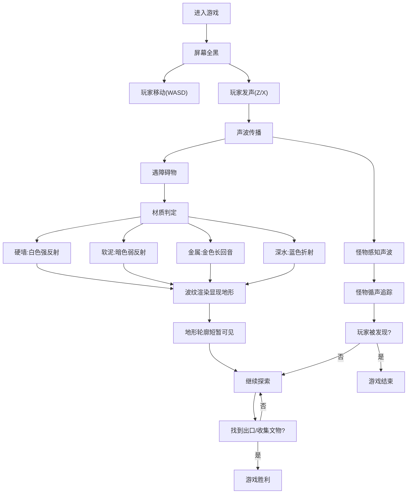

## 1. 产品概述

这是一款基于声波回声定位的沉浸式探险游戏。玩家身处完全漆黑的地牢中，通过敲击或吹口哨发出声波，利用声波的反射、衍射和吸收等物理特性来"看见"周围环境。游戏融合了听觉与视觉的通感体验，创造独特的探索玩法。

- 核心玩法：利用声波物理模拟实现回声定位探索
- 目标用户：喜欢独特创意玩法、沉浸体验的玩家
- 市场价值：创新的声觉视觉化玩法，填补细分市场空白

## 2. 核心功能

### 2.1 用户角色
| 角色 | 注册方式 | 核心权限 |
|------|---------|----------|
| 玩家 | 无需注册 | 完整游戏体验 |

### 2.2 功能模块
1. **游戏主界面**：Canvas 游戏画布、HUD 信息显示、操作提示
2. **声波物理系统**：波前传播、障碍物反射、材质吸收、边缘衍射
3. **地形系统**：硬墙、软泥、金属管道、深水区，每种材质声学特性不同
4. **角色系统**：玩家移动、发声体力管理、碰撞检测
5. **怪物AI系统**：盲眼怪物循声追踪、巡逻行为
6. **目标系统**：出口与隐藏文物收集、关卡进度
7. **音效系统**：Web Audio API 实现 3D 音效与混响
8. **视觉渲染系统**：波纹着色、地形轮廓显现、通感色彩映射

### 2.3 页面详情
| 页面名称 | 模块名称 | 功能描述 |
|---------|---------|----------|
| 开始页面 | 标题模块 | 游戏标题、开始按钮、操作说明 |
| 开始页面 | 设置模块 | 音量控制、画质设置 |
| 游戏页面 | 画布模块 | 主游戏渲染区域 |
| 游戏页面 | HUD模块 | 体力条、文物计数、提示信息 |
| 游戏页面 | 暂停菜单 | 暂停、继续、重新开始、退出 |
| 结束页面 | 结果模块 | 胜负判定、统计数据、重新开始 |

## 3. 核心流程

玩家进入游戏后，初始屏幕完全黑暗。玩家通过 WASD 或方向键移动，按 Z 键敲击（低频高消耗）或 X 键吹口哨（高频低消耗）发出声波。声波向四周传播，碰到不同材质产生不同颜色和衰减速度的反射波纹，被波纹扫过的地形轮廓短暂显现。玩家需要合理管理体力，在躲避循声怪物的同时，找到出口或收集隐藏的文物。

## 4. 用户界面设计

### 4.1 设计风格
- **主色调**：深邃的黑暗背景 (#05050a)，配合霓虹色系的声波波纹
- **色彩映射**：
  - 硬墙反射：冷白色 (#e8f4ff)
  - 软泥吸收：暗紫色 (#4a2c6a)
  - 金属回音：金黄色 (#ffd700)
  - 深水折射：深海蓝 (#1e90ff)
  - 玩家声波：青色 (#00ffff)
  - 危险波纹：暗红色 (#ff3333)
- **字体**：使用 "JetBrains Mono" 等宽字体，营造科技感和神秘感
- **布局**：全屏沉浸式 Canvas，HUD 元素位于四角，半透明设计
- **视觉效果**：颗粒噪点、扫描线、辉光效果、CRT 显示器滤镜

### 4.2 页面设计概述
| 页面名称 | 模块名称 | UI 元素 |
|---------|---------|---------|
| 开始页面 | 标题模块 | 居中大标题，声波波纹动画背景，渐显开始按钮 |
| 开始页面 | 设置模块 | 滑动条控制音量，下拉菜单选择画质 |
| 游戏页面 | 画布模块 | 全屏 Canvas，黑色背景，波纹粒子效果 |
| 游戏页面 | HUD模块 | 左上体力条，右上文物计数，底部操作提示 |
| 游戏页面 | 暂停菜单 | 半透明黑色遮罩，居中按钮列表 |
| 结束页面 | 结果模块 | 大字体结果文字，统计数据，脉冲动画按钮 |

### 4.3 响应性
- 桌面端优先设计，支持 1920×1080 及以上分辨率
- Canvas 自适应窗口大小，保持游戏区域比例
- 键盘操作：WASD/方向键移动，Z/X 发声，ESC 暂停
- 鼠标支持：点击发声位置可选

### 4.4 视觉与音效通感设计
- 声波频率映射到颜色：低频偏红，高频偏蓝
- 声波振幅映射到亮度和波纹粗细
- 混响效果通过波纹的多次反射和衰减模拟
- 不同材质的反射波有独特的波形模式和色彩
- 接近危险时，画面边缘出现红色脉动警告
