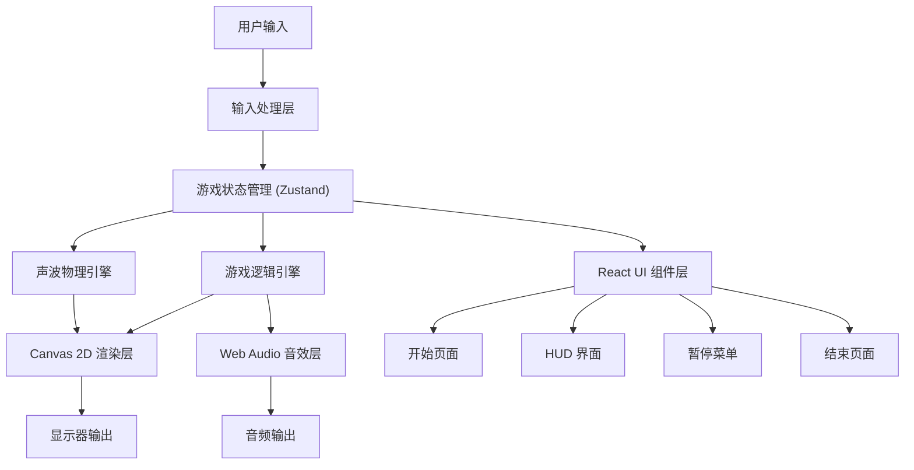

## 1. 架构设计

本项目采用纯前端架构，所有计算和渲染都在浏览器端完成，无需后端服务。核心分为物理引擎层、渲染层、游戏逻辑层和UI层，通过状态管理实现各层间的解耦通信。



## 2. 技术描述

- **前端框架**：React@18 + TypeScript + Vite
- **状态管理**：Zustand，用于管理游戏全局状态
- **样式方案**：TailwindCSS@3，用于 UI 组件样式
- **渲染技术**：HTML5 Canvas 2D API，高性能声波波纹渲染
- **音频技术**：Web Audio API，实现 3D 音效和混响效果
- **物理模拟**：自研声波物理引擎，基于射线追踪和波动方程
- **初始化工具**：vite-init

## 3. 核心数据结构

### 3.1 类型定义

```typescript
// 材质类型
type MaterialType = 'wall' | 'mud' | 'metal' | 'water' | 'empty' | 'exit' | 'artifact';

// 声波类型
type WaveType = 'knock' | 'whistle';

// 材质声学属性
interface MaterialProperties {
  reflectivity: number;      // 反射系数 0-1
  absorption: number;        // 吸收系数 0-1
  diffraction: number;       // 衍射系数 0-1
  color: string;             // 反射波颜色
  decayRate: number;         // 衰减速率
  echoCount: number;         // 回音次数
}

// 地形格子
interface TerrainCell {
  x: number;
  y: number;
  type: MaterialType;
  revealed: boolean;
  revealTime: number;
}

// 声波粒子
interface WaveParticle {
  x: number;
  y: number;
  vx: number;
  vy: number;
  amplitude: number;
  frequency: number;
  age: number;
  maxAge: number;
  color: string;
  bounced: boolean;
  sourceType: WaveType;
}

// 玩家
interface Player {
  x: number;
  y: number;
  stamina: number;
  maxStamina: number;
  staminaRegen: number;
  artifacts: number;
}

// 盲眼怪物
interface Monster {
  x: number;
  y: number;
  speed: number;
  hearingRange: number;
  targetX: number;
  targetY: number;
  alerted: boolean;
  alertTime: number;
  patrolPoints: { x: number; y: number }[];
  patrolIndex: number;
}

// 游戏状态
interface GameState {
  phase: 'menu' | 'playing' | 'paused' | 'won' | 'lost';
  player: Player;
  monsters: Monster[];
  terrain: TerrainCell[][];
  waves: WaveParticle[];
  gridWidth: number;
  gridHeight: number;
  cellSize: number;
  totalArtifacts: number;
  settings: {
    volume: number;
    quality: 'low' | 'medium' | 'high';
  };
}
```

## 4. 核心模块设计

### 4.1 声波物理引擎

**文件位置**：`src/engine/WaveEngine.ts`

核心算法：
1. **波前传播**：使用粒子系统模拟声波传播，每个粒子携带振幅、频率、相位信息
2. **反射计算**：粒子碰撞时根据法线计算反射向量，乘以材质反射系数
3. **吸收模拟**：每次碰撞根据材质吸收系数衰减振幅
4. **衍射效果**：在障碍物边缘生成次级波源，模拟惠更斯原理
5. **折射计算**：深水区域改变波速和传播方向

```typescript
// 核心函数签名
interface WaveEngine {
  emitWave(x: number, y: number, type: WaveType): void;
  update(deltaTime: number): void;
  processCollisions(): void;
  calculateDiffraction(): void;
}
```

### 4.2 地形系统

**文件位置**：`src/engine/TerrainSystem.ts`

材质属性表：
| 材质 | 反射率 | 吸收率 | 衍射率 | 颜色 | 衰减速率 | 回音次数 |
|------|--------|--------|--------|------|----------|----------|
| 硬墙 | 0.9 | 0.1 | 0.1 | #e8f4ff | 0.02 | 1 |
| 软泥 | 0.2 | 0.8 | 0.3 | #4a2c6a | 0.08 | 0 |
| 金属 | 0.95 | 0.05 | 0.05 | #ffd700 | 0.01 | 3 |
| 深水 | 0.3 | 0.5 | 0.6 | #1e90ff | 0.05 | 0 |

### 4.3 渲染系统

**文件位置**：`src/renderer/CanvasRenderer.ts`

渲染管线：
1. 清空画布（纯黑）
2. 绘制已揭示的地形轮廓（根据 revealTime 淡出）
3. 绘制所有声波粒子（带辉光效果）
4. 绘制玩家位置（微弱光点）
5. 绘制怪物位置（仅当被声波照亮时）
6. 应用后期效果（扫描线、噪点、边缘光晕）

### 4.4 怪物AI系统

**文件位置**：`src/engine/MonsterAI.ts`

行为状态机：
- **巡逻状态**：沿预设路径缓慢移动，听力范围小
- **警觉状态**：听到声波后转向声源方向，移动速度加快
- **追击状态**：确定玩家位置后高速追击

### 4.5 音效系统

**文件位置**：`src/audio/AudioSystem.ts`

使用 Web Audio API 实现：
- 不同频率的发声（敲击低频，口哨高频）
- 3D 声道定位（根据反射位置计算立体声）
- 混响效果（ConvolverNode 模拟地牢声学）
- 动态音量控制（根据振幅调整）

## 5. 项目目录结构

```
src/
├── components/          # React UI 组件
│   ├── StartPage.tsx    # 开始页面
│   ├── HUD.tsx          # 游戏内界面
│   ├── PauseMenu.tsx    # 暂停菜单
│   ├── EndPage.tsx      # 结束页面
│   └── GameCanvas.tsx   # Canvas 包装组件
├── engine/              # 游戏引擎
│   ├── WaveEngine.ts    # 声波物理引擎
│   ├── TerrainSystem.ts # 地形系统
│   ├── MonsterAI.ts     # 怪物AI
│   └── GameEngine.ts    # 游戏主循环
├── renderer/            # 渲染系统
│   └── CanvasRenderer.ts
├── audio/               # 音频系统
│   └── AudioSystem.ts
├── store/               # 状态管理
│   └── useGameStore.ts
├── types/               # 类型定义
│   └── game.ts
├── utils/               # 工具函数
│   ├── math.ts          # 数学工具
│   ├── levelData.ts     # 关卡数据
│   └── materials.ts     # 材质配置
├── App.tsx
├── main.tsx
└── index.css
```

## 6. 性能优化策略

1. **粒子数量控制**：根据画质设置限制最大粒子数（低 200，中 500，高 1000）
2. **空间分区**：使用网格空间分区加速碰撞检测
3. **对象池**：复用声波粒子对象，避免频繁 GC
4. **增量渲染**：地形轮廓淡出使用 alpha 混合，无需每帧重绘全部
5. **帧同步**：使用 requestAnimationFrame，固定逻辑步长，可变渲染帧率
